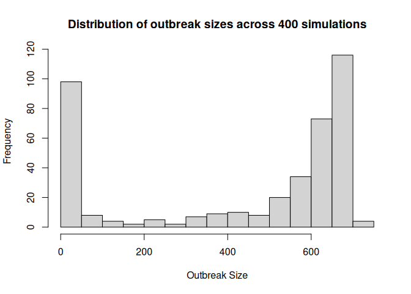

<!-- README.md is generated from README.qmd. Please edit that file -->

# measles 

<!-- badges: start -->

[](https://github.com/EpiForeSITE)
[](https://CRAN.R-project.org/package=measles)
[](https://github.com/UofUEpiBio/measles/actions/workflows/r.yml)
[](https://cran.r-project.org/package=measles)
[](https://github.com/UofUEpiBio/measles/blob/master/LICENSE.md)
[](https://app.codecov.io/gh/UofUEpiBio/measles)
[](https://CRAN.R-project.org/package=measles)

<!-- badges: end -->

## Overview

The **measles** package is a specialized spinoff from
[epiworldR](https://github.com/UofUEpiBio/epiworldR), focusing
exclusively on measles epidemiological models. This package provides
fast, agent-based models (ABMs) for studying measles transmission
dynamics, vaccination strategies, and intervention policies.

Built on the powerful [epiworld](https://github.com/UofUEpiBio/epiworld)
C++ library, these models leverage the speed and flexibility of
epiworldR while providing specialized functionality for measles outbreak
modeling.

You can learn more about the ongoing efforts to model measles outbreaks
in ForeSITE’s measles repository:
<https://github.com/EpiForeSITE/measles>.

## Features

- **Fast simulation**: Leverages the high-performance C++ backend from
  epiworld
- **Specialized measles models**: Three distinct models tailored for
  different scenarios
- **Flexible interventions**: Support for vaccination, quarantine,
  isolation, and contact tracing
- **Population mixing**: Models can account for different population
  groups with varying contact patterns
- **Risk-based strategies**: Advanced models support risk-stratified
  quarantine policies

## Models Included

The package includes three measles-specific models:

1.  **ModelMeaslesSchool**: A SLIHR
    (Susceptible-Latent-Infectious-Hospitalized-Recovered) model
    designed for school settings with isolation and quarantine policies.

2.  **ModelMeaslesMixing**: A measles model with population mixing
    between different groups, including vaccination, quarantine,
    isolation, and contact tracing mechanisms.

3.  **ModelMeaslesMixingRiskQuarantine**: An advanced mixing model with
    risk-based quarantine strategies that assign different quarantine
    durations based on exposure risk levels (high, medium, low).

## Installation

You can install the measles package from GitHub:

``` r
# install.packages("devtools")
devtools::install_github("UofUEpiBio/measles")
```

Or from <a href="https://uofuepibio.r-universe.dev/"
target="_blank">R-universe</a> (recommended for the latest development
version):

``` r
install.packages(
  'measles',
  repos = c(
    'https://uofuepibio.r-universe.dev',
    'https://cloud.r-project.org'
  )
)
```

## Quick Example

Here’s a simple example using the ModelMeaslesSchool:

``` r
library(measles)
#> Loading required package: epiworldR
#> Thank you for using epiworldR! Please consider citing it in your work.
#> You can find the citation information by running
#>   citation("epiworldR")

# Create a measles model for a school with 500 students
model_school <- ModelMeaslesSchool(
  n = 500,
  contact_rate = 10 / .9 / 4, # R0 of 10
  prevalence = 1,
  prop_vaccinated = 0.70,
  quarantine_period = -1,
  vax_efficacy = 0.97
)

# Run the simulation
run_multiple(
  model_school,
  ndays = 200,
  seed = 1912,
  nsims = 400,
  saver = make_saver("outbreak_size"),
  nthreads = 4L
)
#> Starting multiple runs (400) using 4 thread(s)
#> _________________________________________________________________________
#> _________________________________________________________________________
#> ||||||||||||||||||||||||||||||||||||||||||||||||||||||||||||||||||||||||| done.
```

We can take a quick look at the last run using the `summary()` function:

``` r
# View results
summary(model_school)
#> ________________________________________________________________________________
#> ________________________________________________________________________________
#> SIMULATION STUDY
#>
#> Name of the model   : (none)
#> Population size     : 500
#> Agents' data        : (none)
#> Number of entities  : 0
#> Days (duration)     : 200 (of 200)
#> Number of viruses   : 1
#> Last run elapsed t  : 1.00ms
#> Total elapsed t     : 186.00ms (400 runs)
#> Last run speed      : 52.71 million agents x day / second
#> Average run speed   : 214.04 million agents x day / second
#> Rewiring            : off
#> Last seed used      : 1264933217
#>
#> Global events:
#>  - Quarantine process (runs daily)
#>
#> Virus(es):
#>  - Measles
#>
#> Tool(s):
#>  - MMR
#>
#> Model parameters:
#>  - (IGNORED) Vax improved recovery : 0.0e+00
#>  - Contact rate                    : 2.7778
#>  - Days undetected                 : 2.0000
#>  - Hospitalization period          : 7.0000
#>  - Hospitalization rate            : 0.2000
#>  - Incubation period               : 12.0000
#>  - Isolation period                : 4.0000
#>  - Prodromal period                : 4.0000
#>  - Quarantine period               : -1.0000
#>  - Quarantine willingness          : 1.0000
#>  - Rash period                     : 3.0000
#>  - Transmission rate               : 0.9000
#>  - Vaccination rate                : 0.7000
#>  - Vax efficacy                    : 0.9700
#>
#> Distribution of the population at time 200:
#>   - ( 0) Susceptible             : 499 -> 350
#>   - ( 1) Latent                  :   1 -> 0
#>   - ( 2) Prodromal               :   0 -> 0
#>   - ( 3) Rash                    :   0 -> 0
#>   - ( 4) Isolated                :   0 -> 0
#>   - ( 5) Isolated Recovered      :   0 -> 0
#>   - ( 6) Quarantined Latent      :   0 -> 0
#>   - ( 7) Quarantined Susceptible :   0 -> 0
#>   - ( 8) Quarantined Prodromal   :   0 -> 0
#>   - ( 9) Quarantined Recovered   :   0 -> 0
#>   - (10) Hospitalized            :   0 -> 0
#>   - (11) Recovered               :   0 -> 150
#>
#> Transition Probabilities:
#>  - Susceptible              1.00  0.00     -     -     -     -     -     -     -     -     -     -
#>  - Latent                      -  0.92  0.08     -     -     -     -     -     -     -     -     -
#>  - Prodromal                   -     -  0.73  0.14  0.13     -     -     -     -     -     -     -
#>  - Rash                        -     -     -  0.23  0.21     -     -     -     -     -  0.21  0.35
#>  - Isolated                    -     -     -  0.03  0.46  0.26     -     -     -     -  0.21  0.04
#>  - Isolated Recovered          -     -     -     -     -  0.57     -     -     -     -     -  0.43
#>  - Quarantined Latent          -     -     -     -     -     -     -     -     -     -     -     -
#>  - Quarantined Susceptible     -     -     -     -     -     -     -     -     -     -     -     -
#>  - Quarantined Prodromal       -     -     -     -     -     -     -     -     -     -     -     -
#>  - Quarantined Recovered       -     -     -     -     -     -     -     -     -     -     -     -
#>  - Hospitalized                -     -     -     -     -     -     -     -     -     -  0.88  0.12
#>  - Recovered                   -     -     -     -     -     -     -     -     -     -     -  1.00
```

And we can extract the results (outbreak size in this case), using the
function `run_multiple_get_results()`:

``` r
ans <- run_multiple_get_results(model_school)[[1]]
ans <- subset(ans, date == max(date))$outbreak_size
table(ans) |>
  prop.table() |>
  knitr::kable(
    col.names = c("Outbreak Size", "Proportion of Simulations"),
    digits = 3,
    caption = "Distribution of outbreak sizes across 400 simulations"
  )
```

| Outbreak Size | Proportion of Simulations |
|:--------------|--------------------------:|
| 1             |                     0.195 |
| 2             |                     0.032 |
| 3             |                     0.013 |
| 4             |                     0.010 |
| 6             |                     0.002 |
| 7             |                     0.002 |
| 136           |                     0.002 |
| 137           |                     0.002 |
| 139           |                     0.005 |
| 140           |                     0.002 |
| 141           |                     0.002 |
| 142           |                     0.007 |
| 143           |                     0.007 |
| 144           |                     0.020 |
| 145           |                     0.002 |
| 146           |                     0.015 |
| 147           |                     0.025 |
| 148           |                     0.010 |
| 149           |                     0.032 |
| 150           |                     0.040 |
| 151           |                     0.050 |
| 152           |                     0.048 |
| 153           |                     0.050 |
| 154           |                     0.062 |
| 155           |                     0.045 |
| 156           |                     0.070 |
| 157           |                     0.050 |
| 158           |                     0.065 |
| 159           |                     0.045 |
| 160           |                     0.022 |
| 161           |                     0.020 |
| 162           |                     0.007 |
| 163           |                     0.015 |
| 164           |                     0.002 |
| 165           |                     0.010 |
| 166           |                     0.007 |

Distribution of outbreak sizes across 400 simulations

## Example with Population Mixing

The mixing models allow you to simulate measles spread across different
population groups:

``` r
# Define three populations
e1 <- entity("Population 1", 3000, as_proportion = FALSE)
e2 <- entity("Population 2", 3000, as_proportion = FALSE)
e3 <- entity("Population 3", 3000, as_proportion = FALSE)

# Define contact matrix (expected contacts per group and time step)
contact_matrix <- matrix(c(
  0.9, 0.05, 0.05,
  0.1, 0.8,  0.1,
  0.1, 0.2,  0.7
) * 15, byrow = TRUE, nrow = 3)

# Create the model
measles_model <- ModelMeaslesMixing(
  n = 9000,
  prevalence = 1 / 9000,
  transmission_rate = 0.9,
  vax_efficacy = 0.97,
  prop_vaccinated = 0.95,
  contact_matrix = contact_matrix,
  quarantine_period = 14,
  isolation_period = 10
)

# Add entities and run
measles_model |>
  add_entity(e1) |>
  add_entity(e2) |>
  add_entity(e3)

run_multiple(
  measles_model, ndays = 100, seed = 331,
  nsims = 400,
  saver = make_saver("outbreak_size"),
  nthreads = 4L
)
#> Starting multiple runs (400) using 4 thread(s)
#> _________________________________________________________________________
#> _________________________________________________________________________
#> ||||||||||||||||||||||||||||||||||||||||||||||||||||||||||||||||||||||||| done.

summary(measles_model)
#> ________________________________________________________________________________
#> ________________________________________________________________________________
#> SIMULATION STUDY
#>
#> Name of the model   : Measles with Mixing and Quarantine
#> Population size     : 9000
#> Agents' data        : (none)
#> Number of entities  : 3
#> Days (duration)     : 100 (of 100)
#> Number of viruses   : 1
#> Last run elapsed t  : 0.00s
#> Total elapsed t     : 1.00s (400 runs)
#> Last run speed      : 82.84 million agents x day / second
#> Average run speed   : 323.49 million agents x day / second
#> Rewiring            : off
#> Last seed used      : 1428497254
#>
#> Global events:
#>  - Quarantine process (runs daily)
#>
#> Virus(es):
#>  - Measles
#>
#> Tool(s):
#>  - MMR
#>
#> Model parameters:
#>  - (IGNORED) Vax improved recovery : 0.5000
#>  - Contact tracing days window     : 4.0000
#>  - Contact tracing success rate    : 1.0000
#>  - Days undetected                 : 2.0000
#>  - Hospitalization period          : 7.0000
#>  - Hospitalization rate            : 0.2000
#>  - Incubation period               : 12.0000
#>  - Isolation period                : 10.0000
#>  - Isolation willingness           : 1.0000
#>  - Prodromal period                : 4.0000
#>  - Quarantine period               : 14.0000
#>  - Quarantine willingness          : 1.0000
#>  - Rash period                     : 3.0000
#>  - Transmission rate               : 0.9000
#>  - Vaccination rate                : 0.9500
#>  - Vax efficacy                    : 0.9700
#>
#> Distribution of the population at time 100:
#>   - ( 0) Susceptible             : 8999 -> 8365
#>   - ( 1) Latent                  :    1 -> 99
#>   - ( 2) Prodromal               :    0 -> 39
#>   - ( 3) Rash                    :    0 -> 14
#>   - ( 4) Isolated                :    0 -> 13
#>   - ( 5) Isolated Recovered      :    0 -> 47
#>   - ( 6) Quarantined Latent      :    0 -> 22
#>   - ( 7) Quarantined Susceptible :    0 -> 5
#>   - ( 8) Quarantined Prodromal   :    0 -> 10
#>   - ( 9) Quarantined Recovered   :    0 -> 0
#>   - (10) Hospitalized            :    0 -> 38
#>   - (11) Recovered               :    0 -> 348
#>
#> Transition Probabilities:
#>  - Susceptible              1.00  0.00     -     -     -     -  0.00  0.00     -     -     -     -
#>  - Latent                      -  0.89  0.08     -     -     -  0.03     -  0.00     -     -     -
#>  - Prodromal                   -     -  0.75  0.24  0.00     -     -     -  0.01     -     -     -
#>  - Rash                        -     -     -  0.23  0.24  0.15     -     -     -     -  0.19  0.19
#>  - Isolated                    -     -     -     -  0.48  0.31     -     -     -     -  0.21     -
#>  - Isolated Recovered          -     -     -     -     -  0.89     -     -     -     -     -  0.11
#>  - Quarantined Latent          -  0.03  0.00     -     -     -  0.90     -  0.07     -     -     -
#>  - Quarantined Susceptible  0.06     -     -     -     -     -     -  0.94     -     -     -     -
#>  - Quarantined Prodromal       -     -  0.04     -  0.22     -     -     -  0.73     -     -     -
#>  - Quarantined Recovered       -     -     -     -     -     -     -     -     -     -     -     -
#>  - Hospitalized                -     -     -     -     -     -     -     -     -     -  0.86  0.14
#>  - Recovered                   -     -     -     -     -     -     -     -     -     -     -  1.00
```

``` r
ans <- run_multiple_get_results(measles_model)[[1]]
ans <- subset(ans, date == max(date))$outbreak_size |>
  hist(
    main = "Distribution of outbreak sizes across 400 simulations",
    xlab = "Outbreak Size",
    ylab = "Frequency",
    breaks = 20
  )
```



## Relationship to epiworldR

This package is a spinoff from epiworldR, which provides a comprehensive
framework for agent-based epidemiological models. While epiworldR
includes many different disease models (SIR, SEIR, SIS, etc.), the
measles package focuses specifically on measles-related models with
specialized features for:

- Measles-specific disease progression (incubation, prodromal, and rash
  periods)
- School-based outbreak scenarios
- Vaccination coverage and efficacy
- Quarantine and isolation policies
- Contact tracing strategies
- Risk-stratified interventions

For general-purpose epidemiological modeling or other disease types,
please see the [epiworldR
package](https://github.com/UofUEpiBio/epiworldR).

## Citation

If you use the measles package in your research, please cite both this
package and epiworldR:

``` r
citation("measles")
citation("epiworldR")
```

## Contributing

Contributions are welcome! Please see the [`measles` development
guidelines](https://github.com/UofUEpiBio/measles/blob/main/DEVELOPMENT.md)
for information on how to contribute.

## Acknowledgments

This project was made possible by cooperative agreement
CDC-RFA-FT-23-0069 from the CDC’s Center for Forecasting and Outbreak
Analytics. Its contents are solely the responsibility of the authors and
do not necessarily represent the official views of the Centers for
Disease Control and Prevention.
